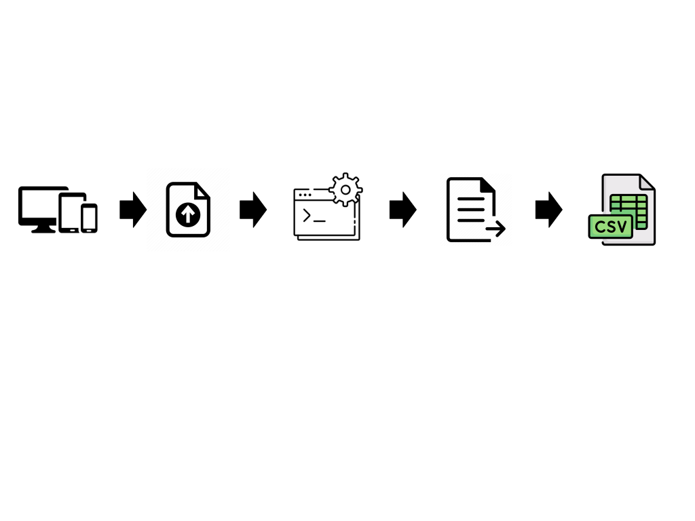
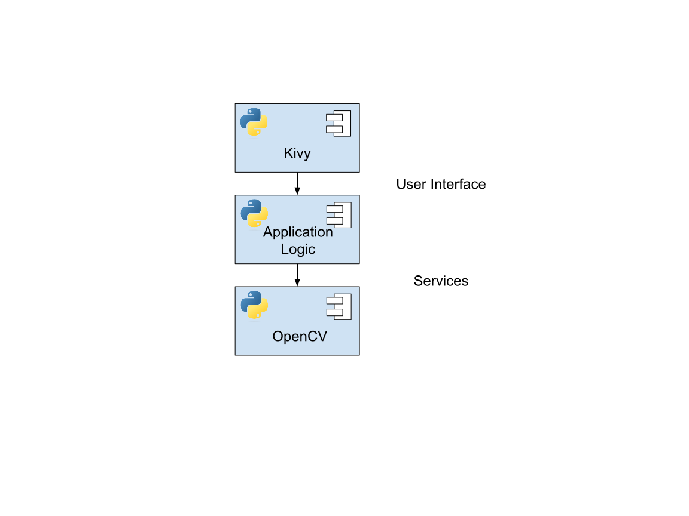

# Consolidated Project Assets

CS 463 - Senior Software Engineering Project III

Instructors: Kirsten Winters and Alexander Ulbrich 

Project Partner: Benjamin Philmus

Owen Williamson, Johnny Li, Ryoga Ojima, Andres Perez, Andrew Vester

June 2, 2024

# Abstract

This document serves as a comprehensive overview of the period since the Fall term's development efforts, encapsulating the team's progress and project documentation regarding the Bacterial Colony Processing Software. It delves into the project's plans, goals, and overall development process, providing a consolidated view of the project's journey and outcomes.

# 1.0 Product Requirements Document (PRD)

## 1.1 Problem Description

The manual process of bacterial colony counting poses significant challenges in biological research, consuming valuable time to analyze a single petri dish. The inefficiencies in the manual counting method act as a bottleneck to researchers' progress, hindering their productivity and limiting their ability to focus on other aspects of their studies.

### 1.1.1 Scope

The scope for this product will be limited to scanning standard 50-100mm round petri dishes to provide a counted output of bacterial colonies. The primary focus is on delivering a reliable solution for the most common laboratory use cases. Stretch goals include additional features such as adjusting to different petri dish shapes, flagging indistinguishable colonies, implementing batch processing of petri dish images, providing a preview of detected colonies, and exploring the creation of a mobile application.

Our scope is specifically tailored to our project partner’s laboratory applications due to time constraints inherent in the scope of the CS Capstone course. By concentrating on the specific requirements of our project partner, we ensure a more targeted and achievable project outcome within the given timeframe.

### 1.1.2 Use Cases

We want to test the image processing first.

The user will upload an image of a petri dish, once uploaded, the program will begin processing the image and output a colony count based on the petri dish image.

After image processing is complete, we want to test a couple stretch goal implementations.

The user will upload an image of a petri dish, once uploaded, the program will ask the user to confirm/draw the area for the image to crop to the shape of the petri dish, then run and output the colony count.

The user will upload several images of a petri dish, once uploaded, the program will generate a table based on the image file names and output the colony count for the user to read.

# 

## 1.2 Purpose and Vision (Background)

Our purpose is to develop a streamlined and more efficient process to bacterial colony processing from an image upload, providing users with the ability to more easily count bacterial colonies and give back researchers valuable time in their endeavors.  

We want to become a simple cross platform application for anybody looking to count bacterial colonies on their petri dishes.

Up to now, bacterial colony processing is either: very expensive in utilizing counting machinery or tedious in counting individual colonies by hand. Our vision is to develop a low-cost cross platform application to automate colony counting, providing researchers with an efficient and user-friendly solution.

## 1.3 Stakeholders

In the ecosystem of our project, various stakeholders play critical roles in its success and impact. These stakeholders include:

* Project Partner: The collaborator directly involved in the development and implementation of the project.
* Teaching Assistant: A supporting role contributing to the project's academic and practical aspects.
* Course Instructor: Providing guidance and oversight, the course instructor ensures alignment with educational objectives.
* Users: The primary beneficiaries of our project, whose needs and feedback are integral to its design and functionality.

## 

## 1.4 Preliminary Context

### 1.4.1 Assumptions

In outlining the assumptions guiding our project's direction, we acknowledge the following premises:

* We have access to users that will provide valuable feedback in a timely manner (i.e., weekly).
* Libraries used in development are thoroughly tested and reasonably assured to be functional.
* We can develop an application capable of running across multiple devices and screen sizes without an internet connection (PC, tablet, mobile).
* We have six months to prove core functionality, and three more months until our project ends.

### 1.4.2 Constraints

Additionally, in outlining the constraints, we must navigate several constraints that shape our approach and outcomes:

* We need to make sure that open source work used is properly credited for the rights to use the source code. 
* We are expected to make this application be low-cost in terms of financial limitations.
* We are a small team, and we should start small but functional. We plan to have a functional model done in winter term. 
* Our team is built on top of a course project, therefore, time constraints exist with not only three terms of progress, but also team members have other priorities with coursework which hinders sole focus entirely on this project.
* Our team has a varied skill set applicable to the development of this project.

### 1.4.3 Dependencies

Our project's functionality and success hinge on several key dependencies:

* We are dependent on existing libraries and software to process our petri dish images.
* We need a database to store the resulting spreadsheet of found bacterial colonies.
* We are reliant on user files to upload images into our application.

## 1.5 Market Assessment and Competition Analysis

In our market assessment and competition analysis, we have identified several existing solutions:

* OpenCFU: Although it offers a free and open-source option, its user interface may be considered outdated and requires a certain level of proficiency.
* ImageJ: Another free and open-source tool, ImageJ's strength lies in its robust functionality, yet its complex user interface and setup process can be daunting for some users.
* Machinery: While this option is straightforward to use and facilitates automation in colony counting, it comes at a higher cost compared to the aforementioned alternatives.

## 

## 1.6 Target Demographics (User Persona)

Our target demographics encompass individuals like John and Leslie:

* John is a 16 year old lab assistant who is frustrated with sitting around all day counting bacterial colonies and not getting time to experiment more with the opportunities in the laboratory environment. 
* Leslie is a 26 year old researcher who is busy with her other responsibilities and needs an easier method to count colonies that doesn’t require the tedious manual effort. She can’t acquire the funds to buy an expensive machine to do the work for her and wants a cheaper solution.

## 

## 1.7 Requirements

### 1.7.1 User Stories and Features (Functional Requirements)

<table>
  <tr>
   <td><strong>User Story</strong>
   </td>
   <td><strong>Feature</strong>
   </td>
   <td><strong>Priority</strong>
   </td>
   <td><strong>GitHub Issue</strong>
   </td>
   <td><strong>Dependencies</strong>
   </td>
  </tr>
  <tr>
   <td>As a microbiologist, I want to upload images to the application so that I can have them processed.
   </td>
   <td>Image Upload Interface
   </td>
   <td>Must Have
   </td>
   <td><a href="https://github.com/li-johnny/colony-capstone/issues/9">#9</a>
   </td>
   <td>Functioning frontend for image upload
   </td>
  </tr>
  <tr>
   <td>As a high school biology teacher, I want an affordable auto counting system for bacterial colonies, so that I can teach my students the bacterial colonies and the importance of accuracy in experiments.
   </td>
   <td>Bacterial Colony Counting Algorithm
   </td>
   <td>Must Have
   </td>
   <td><a href="https://github.com/li-johnny/colony-capstone/issues/10">#10</a>
   </td>
   <td>N/A
   </td>
  </tr>
  <tr>
   <td>As a lab researcher, I want a simple and intuitive graphical interface, so that both others and I can more easily utilize the system without needing extensive training or documentation.
   </td>
   <td>Intuitive UI Design
   </td>
   <td>Should Have
   </td>
   <td><a href="https://github.com/li-johnny/colony-capstone/issues/14">#14</a>
   </td>
   <td>Functioning frontend
   </td>
  </tr>
  <tr>
   <td>As a Lab Tech I want to be notified and correct any potential miscounts by the program so that we can have accurate and complete data.
   </td>
   <td>Counting Error Detection
   </td>
   <td>Could Have
   </td>
   <td><a href="https://github.com/li-johnny/colony-capstone/issues/13">#13</a>
   </td>
   <td>Functioning image upload and working counting algorithm
   </td>
  </tr>
  <tr>
   <td>As a lab manager I want all of my colony data that my technicians gather to be uploaded to the same file so that my lab can remain efficient and organized.
   </td>
   <td>Multi-User Collaboration Support (User Accounts)
   </td>
   <td>Could Have
   </td>
   <td><a href="https://github.com/li-johnny/colony-capstone/issues/12">#12</a>
   </td>
   <td>Functioning image upload and working counting algorithm
   </td>
  </tr>
</table>

## 

### 1.7.2 Non-Functional Requirements

Our non-functional requirements are defined as follows:

* Response time for user interactions should be less than 500 milliseconds.
* The product should work seamlessly on multiple devices and screen sizes (e.g., desktop, tablet, mobile).
* Code should be well-documented, following coding standards and best practices.
* The product should be aesthetically pleasing with a focus on heuristic design.

### 1.7.3 Data Requirements

Our data requirements encompass the following:

* Supported Image File Types:
    * HEIC
    * JPG
    * JPEG
    * PNG
* Exported Colony Count Files:
    * CSV

### 1.7.4 Integration Requirements

Our integration requirements involve the following components:

* OpenCV
    * Image Processing: 
        * Detecting, analyzing, and counting bacterial colonies within the uploaded images.
    * Image Manipulation: 
        * Cropping, resizing, and color correcting the images to improve colony detection accuracy.

### 

### 1.7.5 User Interaction and Design

The general user process is that from a device, a user will upload their images to the application. From there, once ‘Process’ is clicked, the application will then begin processing the images from the backend before finally outputting an annotated image of detected colonies and option to export a csv file of the bacterial colony count.

## 1.8 Milestones and Timeline

Completion of Frontend User Interface by Fall Term:

* Week 1-4: Assess capabilities and requirements of user interface and integration with backend.
* Week 5: Implement design features and build core functionality for backend integration.
* Week 5-9: Refine user interface design for aesthetics with a focus on heuristic design   
* Week 10: Prepare UI for deployment, awaiting completion and further refinement until backend (colony algorithm completion)

Completion of Backend by Winter Term:

* Fall Term
    * Week 1-5: Assess capabilities and requirements of colony counting system and possible design implementations.
    * Week 6+: Begin development of colony counting algorithm.
    * Week 10: Complete core functionality of colony counting algorithm (able to detect and count a colony, but not accurate)
* Winter Term
    * Week 1: Reassess progress and quality of current colony counting algorithm for later deployment. 
    * Week 2+:
        * Reevaluate GitHub current github issues for areas of concern and further development in raising accuracy of colony counting algorithm.
    * Week 10: Integrate the front and backends for final deployment.

## 1.9 Goals and Success Metrics

<table>
  <tr>
   <td><strong>Goal</strong>
   </td>
   <td><strong>Metric</strong>
   </td>
   <td><strong>Baseline</strong>
   </td>
   <td><strong>Target</strong>
   </td>
   <td><strong>Tracking Method</strong>
   </td>
  </tr>
  <tr>
   <td>Increase Bacterial Accuracy
   </td>
   <td>Compare manual counting vs program
   </td>
   <td>Manual Count
   </td>
   <td>>95% accuracy
   </td>
   <td>Data Analytics
   </td>
  </tr>
  <tr>
   <td>Accurately Count

the Number of

Colonies
   </td>
   <td>Deviation from manual count
   </td>
   <td>90%
   </td>
   <td> >95% accuracy
   </td>
   <td>Data Collection
   </td>
  </tr>
</table>

## 1.10 Testing Plan for Functionality, Performance, and Reliability:

Functionality Testing:

* Use cases and scenarios-based testing covering all user stories and features.
* Testing:
    * GitHub Actions 
    * Manual testing by team members

Performance Testing:

* Load testing with varying image sizes and quantities to measure processing time of non-functional requirements.
* Testing:
    * GitHub Actions

Reliability Testing:

* Stress testing to simulate peak loads, identify failure points, and ensure graceful handling of errors.
* Testing:
    * GitHub Actions

## 1.11 Quality Assurance, Testing Methodologies, and Bug Tracking:

Quality Assurance Approach:

* Continuous integration and regular code reviews to maintain code quality.
* Consistent contingency planning and following of DoD guidelines ensure code is consistent with quality.

Testing Methodologies:

* Unit and Integration testing: image processing interface and integration with backend.
* End-to-end testing covering image upload, processing, and output verification.

Bug Tracking:

* Utilization of GitHub Issues allows for issue logging, prioritization, and resolution.

# 

## 1.12 User Documentation, Help Resources, and Support Channels:

User Documentation:

* Comprehensive documentation in user guides and code functionality exist in project files.
* Inline contextual help within the user interface for guidance.

Support Channels:

* GitHub Issues allows for open support if issues arise for team evaluation. 

## 1.13 Ongoing Support and Updates Post-Launch:

Support Strategy:

* Version-controlled releases and release notes are required to support changes and offer greater transparency.
* Handover processes exist in providing heavy documentation for future developers and releases to build upon the existing project.

Low-Cost Bacterial Colony Processing System

# 2.0 Software Design and Architecture (SDA)

## 

## 2.1 Introduction

Our project aims to create a low-cost bacterial colony processing application that accurately counts colonies on Petri dishes from image inputs. This software architecture is pivotal for functionality, usability, and performance, critical in various fields, particularly biological research, by offering an affordable and reliable solution for automating a tedious and error-prone manual process. It will integrate image processing algorithms, an intuitive interface, and image manipulation. Our primary objectives involve cost-effectiveness, accuracy, user-friendliness, and robust image processing. Adhering to this architectural blueprint ensures the development of functional, well-maintained software benefiting researchers with an efficient, affordable, accurate, and user-friendly solution.

## 2.2 Architectural Goals and Principles

### 2.2.1 Architectural Goals:

Scalability:

* Aim to accommodate increased user loads and data volumes as the application grows, with a primary focus on meeting the main service requirements during development. Future expansions may include additional functionalities, necessitating easy scalability to incorporate these changes seamlessly.

Security:

* Implement robust measures to protect sensitive laboratory data stored within the software, ensuring data integrity and preventing any potential data leaks or breaches.

Seamless Integration:

* Integrate with third-party services like OpenCV for image processing and CSV file generation compatible with Excel. Design the software to effectively manage various file types and code from third-party sources, ensuring smooth and convenient integration.

### 

### 2.2.2 Architectural Principles:

Modularity:

* Design the system with modularity in mind, allowing for easy addition of new features or third-party integrations without disrupting the entire system's functionality.

Separation of Concerns (SoC):

* Implement a clear separation of concerns, ensuring that different components of the application handle distinct functions. This approach enhances code maintainability and reusability for both current and future applications**.**

Minimal Coupling:

* Maintain minimal coupling between different sections of the software to enable independent functionality and testing. This streamlined approach in maintenance and development defines clear software responsibilities, aids scalability, and facilitates future expansions into additional functionalities while maintaining robust security measures

## 

## 2.3 System Overview

User Interface (Interface):

* Responsibilities: The UI serves as the user's front-end interaction point. It manages user inputs, displays image uploads, and provides an intuitive interface for interacting with the application.
* Technology: The UI is primarily developed using python through the Kivy library, to ensure a user-friendly and responsive experience.

Application Logic: 

* Responsibilities: The Application Logic acts as the intermediary between the User Interface (UI) and the Backend. It manages the overall flow of the application, processes user inputs received from the UI, and coordinates the execution of image processing algorithms in collaboration with the Backend. Additionally, it ensures seamless communication between the UI and the Backend, facilitating a cohesive user experience.
* Technology: Developed in Python, the Application Logic leverages the Kivy library to interface with the UI and coordinates with the Backend, utilizing image processing libraries such as OpenCV for efficient data processing.

Backend (Services):

* Responsibilities: The backend server serves as the core of the system. It processes user requests, executes image processing algorithms for colony counting, and connects with the database for data retrieval and storage.
* Technology: The backend server is built using python and employs image processing libraries (e.g. OpenCV) for accurate colony counting.

## 2.4 Architectural Patterns

The chosen architectural pattern for this design will follow the Model-View-Controller (MVC) pattern for its simplicity, modularity, and scalability.

* Simplicity: The MVC pattern offers a straightforward and well-structured separation of concerns between three core components: the Model, View, and Controller. This simplicity is particularly advantageous for this particular small-scale project, as it facilitates ease of development and code maintenance, which aligns with the limited scope of our course project.
* Modularity: MVC encourages modularity, allowing us to work on distinct components independently. This modularity is invaluable, especially in scale, as it supports a more manageable development process and facilitates collaboration within the project team.
* Scalability: While originally designed for scalability in larger applications, the MVC pattern can be effectively scaled down for applications such as for this course. It provides a foundation for scalability, even though the project's immediate scope is modest. This consideration ensures that the architectural choice can evolve with the project's potential growth.

## 2.5 Component Descriptions

User Interface (UI):

* Responsibilities: Manages user interactions and displays content.
* Role in the System: Facilitates user experience and serves as the front-end for user engagement.

Application Logic:

* Responsibilities: Intermediary component that manages the flow of the application, maintaining overall application logic and user interaction.
* Role in the System: Acts as the controller, coordinating interactions between the UI and Backend.

Backend Server:

* Responsibilities: Processes requests, executes business logic, and connects with the Database.
* Role in the System: Acts as the core of the application, ensuring data management and system functionality.

## 

## 2.6 Data Management

Images:

* Structure: Each image is a standalone file, possibly organized within a designated directory.
* Storage: Images are stored locally on the user's device.
* Access: The application reads and writes image files directly on the local filesystem.
* Management: Images not explicitly saved are subject to deletion, ensuring that only relevant and saved images persist.

Colony Data (CSV):

* Structure: Colony data is structured in CSV format, possibly with columns representing different attributes.
* Storage: The colony data is stored as a CSV file, likely within a specified directory.
* Access: The application reads and writes colony data directly to the CSV file on the local filesystem.
* Management: Colony data is managed locally, and unsaved changes may result in overwriting the existing CSV or other appropriate handling.

## 2.7 Interface Design

Image Management:

* Read: The UI triggers requests to the Application Logic to display saved images.
* Write: User actions in the UI prompt the Application Logic to save images locally.

Colony Data Management:

* Read: The Application Logic reads colony data from the local CSV file to display in the UI.
* Write: User actions to modify colony data in the UI result in updates written to the local CSV file.

### 2.7.1 Communication Protocols

Communication within the desktop application is facilitated through a combination of direct file system access and internal API calls. The application interacts with the local file system to read, write, and manage image files and colony data, ensuring efficient handling of locally stored resources. The User Interface (UI) communicates with the Backend through internal API calls, allowing for the coordination of user inputs, image processing requests, and data management operations. User-initiated actions, such as image uploads and colony data modifications, trigger events that prompt the Application Logic to execute corresponding actions. In the case of errors or notifications, an internal event handling mechanism reports events back ensuring that users receive appropriate feedback, contributing to a responsive and user-friendly experience.

## 2.8 Considerations

### 2.8.1 Security

While potential security risks exist, the primary focus is on ensuring the integrity of data, especially given that user inputs are limited to image uploads. Rigorous data validation measures are implemented to prevent improper or malicious file uploads. As the application primarily operates locally, emphasis is placed on securing the local file system, and careful validation is enforced during image processing and data handling to mitigate risks. Notably, all user data, including images and colony data, is stored exclusively within the software locally, minimizing exposure to external threats. This intentional design choice enhances data security by confining storage to the user's device and reducing potential vulnerabilities associated with external storage or network communication.

### 2.8.2 Performance

In this compact application, specialized in image upload and colony counting, performance remains a top priority. To ensure scalability, strategies such as load balancing are implemented to evenly distribute user requests. Asynchronous processing, particularly for image counting tasks, guarantees responsive performance even within a small-scale environment. These approaches collectively fortify the application's performance, making it robust and efficient. Ongoing efforts toward scalability aim to seamlessly accommodate additional functionalities. The algorithm's speed is a crucial consideration, targeting swift annotation of a single image in seconds across diverse devices. This emphasis on scalability and rapid algorithmic processing aligns with the performance-driven approach, ensuring the software evolves to meet expanding functionality requirements

### 2.8.3 Maintenance and Support

For future maintenance and support, the development team is committed to leaving a robust foundation for seamless transition and ongoing improvement. Contact information for the creators, including email addresses or other relevant contact details, will be made available to ensure accessibility for any queries or assistance needed by subsequent teams. In addition to direct contact, comprehensive documentation, including detailed code comments, system architecture, and usage guidelines, will be provided. This documentation aims to empower future developers by offering insights into the intricacies of the application, making it easier to understand and maintain. The combination of contact information and thorough documentation reflects our dedication to facilitating a smooth and sustainable maintenance process, ensuring the longevity and success of the software.

## 2.9 Deployment Strategy

In deploying our target architecture for the desktop application, we'll maintain separate environments for development and production. Initially, lightweight services in the development environment will primarily run the service locally to facilitate testing. Resource sizing will be optimized based on workload needs identified through rigorous load testing, ensuring resources are configured for optimal performance and security during deployment. The first deployment phase will take place on local development machines, focusing on validating the software's functionality and inter-component coherence. This initial deployment, aims to ensure seamless interaction among different system components. Post this phase, we'll transition to a more secure and permanent deployment environment on user devices, refining the user interface, and striving to achieve our software's extended goals for enhanced functionality and user experience.

## 2.10 Testing Strategy

Testing strategies for the desktop application include unit tests, integration tests, and more, primarily conducted in local environments during development and prior to deployment. These tests will focus on verifying image upload functionality and ensuring smooth communication between different components of the application. Later, end-to-end testing will be performed when all systems are in place and functional to simulate a user experience, adequately anticipating how users will interact with the desktop application. The testing approach aligns with the shift in architecture, emphasizing the importance of local testing for a more tailored and efficient validation process.

## 2.11 Glossary

**Application Programming Interface (API):** A set of rules, protocols, and tools for building

software and applications. It specifies how software components should interact, typically referring to a request made by one software application to another.

**ImageJ:** Java-based image processing program.

**Model-View-Controller (MVC):** User interfaces that separates/organizes the related program logic into three interconnected parts.

**User Interface (UI)**: The place/space where interactions between humans and machines

occur.

Low-Cost Bacterial Colony Processing System

# 3.0 Software Development Process (SDP)

## 

## 3.1 Goals and Objectives

In pursuing our project's success, we have outlined the following goals and objectives:

* Develop an asynchronous, flexible process for a Low-Cost Bacterial Colony Processing System.
* Facilitate effective task management through a Kanban-based system to streamline the development workflow.
* Integrate quality assurance practices to ensure code stability, functionality verification, and comprehensive documentation.
* Ensure continuous availability of work items in the backlog.

## 3.2 Principles

Our project operates on fundamental principles that guide our workflow and collaboration:

* We are responsive with our asynchronous communication across Discord and Github Issues to answer within 24 hours.
* We use a Kanban board through Github Projects to continuously work on the backlog.
* The backlog will always have work items ready for the next week at the minimum.
* Pull Requests must be reviewed by at least one team member.
* Pull Requests must meet the DoD requirements.
* All changes need to be developed in a separate git branch (no development on main).

## 

## 3.3 Process

This process is designed for an asynchronous team working on the development of a Bacterial Colony Processing System. As the main scope limitation is both overall project time frame and that team members cannot meet every day with varying work/coursework schedules, collaboration is done online. The use of a Kanban-based process allows for flexibility and effective task management in this process. The expectation is that through this process and scheduling we aim to provide a functional baseline of our application by the end of winter term and in the meantime, achieve milestones for completing the frontend and backend in between our winter deadline.

* Backlog and Planning (Weekly):
    * Team members review and update the project backlog.
    * Identify and prioritize user stories and tasks.
    * Discuss new requirements, issues, or changes.
    * Agree on what to focus on during the upcoming week.
* Kanban Board (Ongoing):
    * Digital Kanban board with columns:
        * Backlog
        * Validated Backlog
        * In Progress
        * In Review
        * Blocked
        * Done
    * Team members pull tasks from the "Validated Backlog" column when they have time and availability.
    * Update the status of tasks by moving them across columns as they progress.
* Development and Testing (Asynchronous):
    * Team members work on their assigned tasks at their own pace and as per their schedules.
    * Members in development implement features, and verify the functionality.
    * Communication occurs through asynchronous channels (Discord and GitHub Issues) to coordinate efforts and address issues.
* Review with Project Partner (On-Demand):
    * Hold an email update or review session with the project partner.
    * Showcase completed tasks and gather feedback.
    * Discuss any changes in project direction.
    * Adjust the backlog and priorities based on project partner input.

# 

## 3.4 Roles

In our project, each team member plays a crucial role in ensuring success and progress. Here are the key roles and responsibilities within our team:

* Project Manager – Owen Williamson
    * Responsibilities:
        * Overseeing the project 
        * Ensuring that tasks stay on track 
        * Coordinating with project partner
        * Managing the timeline
        * Making high-level decisions
    * Purpose:
        * The Project Manager role may be shared among team members on a rotating basis to allow for each team member to gain experience in project management. Emphasis is placed on ensuring that everyone gains experience in team management with respect to both internal and external client needs.
* Scrum Master – Andres Perez
    * Responsibilities:
        * Facilitating team meetings
        * Generating weekly tasks for backlog
        * Prioritizing and allocating tasks amongst team members
        * Tracking and reviewing project progress and team performance
    * Purpose:
        * The Scrum master role may be shared among team members on a rotating basis to allow for each team member to gain experience in being a Scrum Master. Emphasis is placed on ensuring that everyone gains experience in facilitating meetings and understanding the importance of task generation.
* Product Management – Johnny Li
    * Responsibilities:
        * Defining the project's features and functionalities 
        * Ensuring that the final product meets the needs of the project partner
        * Gathering product requirements
        * Creating user stories
        * Documenting product-related decisions and functionality
    * Purpose:
        * The Product Manager role may be shared among team members on a rotating basis to allow for each team member to gain experience in product management. Emphasis is placed on ensuring that everyone gains experience in understanding user needs, defining requirements, and prioritizing features.
* Development Team – Everyone (Owen Williamson, Johnny Li, Ryoga Ojima, Andres Perez, Andrew Vester)
    * Responsibilities:
        * Actual coding and development work 
        * Tasks related to development of frontend, backend, and the implementation of different features.
    * Purpose:
        * All team members are expected to participate in the Development Team. Each member should be involved in coding and development tasks. This workload can be distributed based on expertise and interest throughout development.

# 

## 3.5 Tooling

<table>
  <tr>
   <td>
   </td>
   <td><strong>Program/Software</strong>
   </td>
   <td><strong>Purpose</strong>
   </td>
  </tr>
  <tr>
   <td><strong>Version Control</strong>
   </td>
   <td>GitHub
   </td>
   <td>Enables team collaboration, facilitating versioning and ensuring centralized repository for the project.
   </td>
  </tr>
  <tr>
   <td><strong>Project Management</strong>
   </td>
   <td>GitHub Issues and Projects (Kanban)
   </td>
   <td>Organizes tasks, tracking issues and enables the use of team Kanban board for collaboration.
   </td>
  </tr>
  <tr>
   <td><strong>Documentation</strong>
   </td>
   <td><a href="https://github.com/withastro/starlight">https://github.com/withastro/starlight</a>, Google Drive
   </td>
   <td>Provides a platform for comprehensive documentation and other project assets.
   </td>
  </tr>
  <tr>
   <td><strong>Test Framework</strong>
   </td>
   <td>Playwright
   </td>
   <td>Automate testing functionality to ensure quality, performance and reliability of our application.
   </td>
  </tr>
  <tr>
   <td><strong>Linting and Formatting</strong>
   </td>
   <td>Prettier
   </td>
   <td>Enforces consistent code styling and formatting across development to ensure readability and consistency within the repository. 
   </td>
  </tr>
  <tr>
   <td><strong>CI/CD</strong>
   </td>
   <td>GitHub Actions
   </td>
   <td>Automates continuous integration and deployment to ensure and test code quality and meets the requirements of the team for automated deployments.
   </td>
  </tr>
  <tr>
   <td><strong>IDE</strong>
   </td>
   <td>Visual Studio Code
   </td>
   <td>Provides an IDE for coding, collaboration, and tools for team members.
   </td>
  </tr>
  <tr>
   <td><strong>Graphic Design</strong>
   </td>
   <td>Figma
   </td>
   <td>Provides a platform for creating UI/UX mockups and other graphics used in the project. 
   </td>
  </tr>
  <tr>
   <td><strong>Others</strong>
   </td>
   <td>ImageJ, OpenCV
   </td>
   <td>Tools and software that aid and may be used in the development of the project.
   </td>
  </tr>
</table>

# 

## 3.6 Definition of Done (DoD)

This section serves as the basis behind what we deem as complete and meets our need for testing procedures, bug tracking, and quality control. By having these tasks satisfied, we aim to provide a clear guideline behind how issues must be addressed if bugs arise, and testing procedures completed by other tools are required prior to marking a task/functionality complete.

* Changes are merged (to the main branch).
* Code is approved by team members and feedback is addressed.
* Associated issues are addressed and closed.
* All tests pass and are successful. 
* Documentation is updated and thoroughly describes functionality. 

## 3.7 Risk Management and Contingency Plans

Time is a major scope limitation and requires careful consideration with communication and planning across team members for effective development.

* Risk Management:
    * Tasks are designed to take no more than a week to complete.
    * If a task is too large, a task is broken down into smaller tasks to ensure time availability.
    * Team members are expected to remain communicative with their progress to ensure everyone is on the same page in the event they may not be able to complete the task.
    * Allowing room for buffer time in-between tasks to provide for timeline adjustments if necessary.
* Contingency Plans:
    * If issues arise under quality assurance testing to meet the DoD, a new plan is required to identify and prioritize issues for quick resolution.
    * In the case of unexpected team unavailability, supporting documentation and communication are expected to be well-understood by other team members. Task redistribution may occur or role shifts to maintain project timeline.

# 

## 3.8 Release Cycle

Staging Phase:

* Automatically deploy to staging every merge to the main branch.
* Integration and end-to-end for comprehensive testing before releasing to production.
* Associated bugs or new features are thoroughly tested and monitored by application logic.

Production Release:

* Release to production at the end of each term for comprehensive testing.
* Use semantic versioning MAJOR.minor.patch (provided by course content)
    * Increment the minor version for new features
    * Increment the patch version for bug fixes
    * Increment the major version for breaking API changes
        * Until the API is stable, major should be 0. 

## 3.9 Environments

<table>
  <tr>
   <td><strong>Environment</strong>
   </td>
   <td><strong>Infrastructure</strong>
   </td>
   <td><strong>Deployment</strong>
   </td>
   <td><strong>What is it for?</strong>
   </td>
   <td><strong>Monitoring</strong>
   </td>
  </tr>
  <tr>
   <td>Production
   </td>
   <td>Local (macOS and Windows + IOS and Android)
   </td>
   <td>Release
   </td>
   <td>Final production release for end-users
   </td>
   <td>Logging & Exception Handling
   </td>
  </tr>
  <tr>
   <td>Staging (Test)
   </td>
   <td>Local (macOS and Windows + IOS and Android)
   </td>
   <td>PR
   </td>
   <td>New unreleased features, e2e, and integration tests
   </td>
   <td>Logging & Console Output
   </td>
  </tr>
  <tr>
   <td>Dev
   </td>
   <td>Local (macOS and Windows + IOS and Android)
   </td>
   <td>Commit
   </td>
   <td>Development and unit tests
   </td>
   <td>N/A
   </td>
  </tr>
</table>

